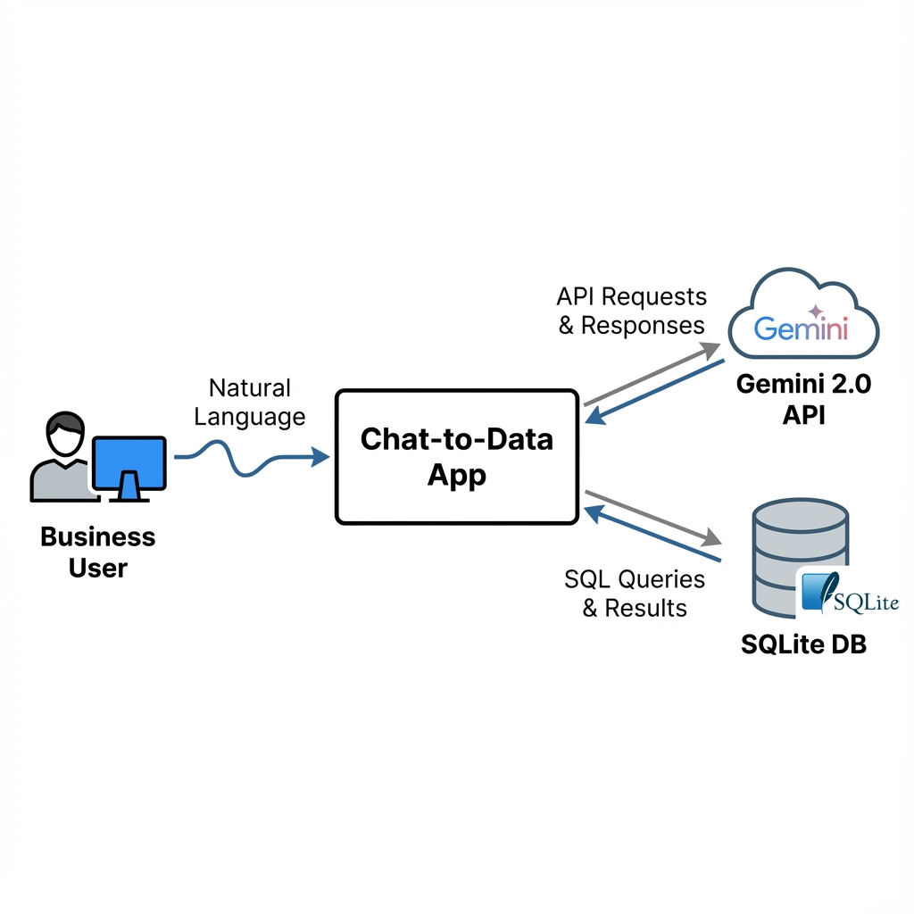
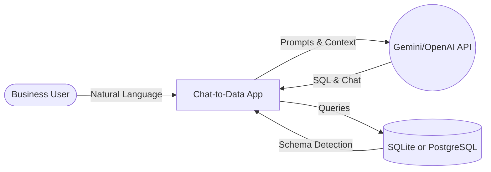
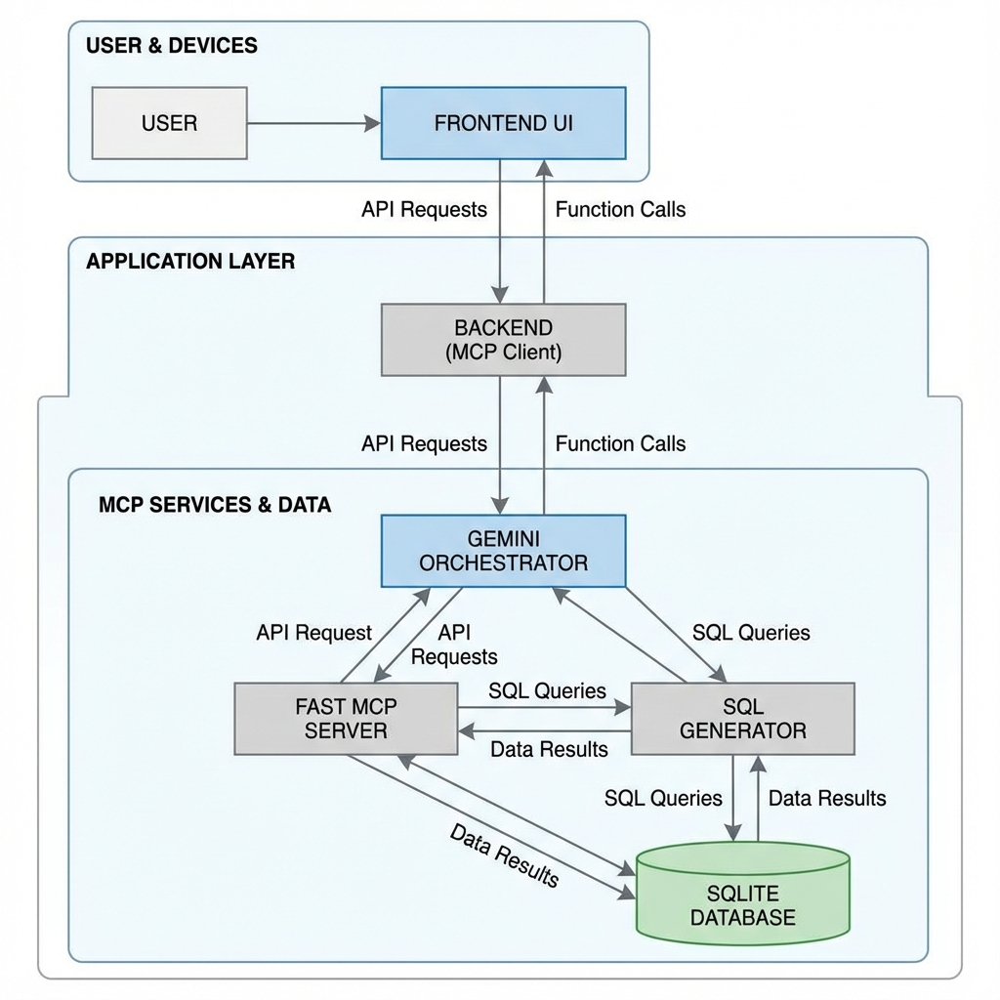
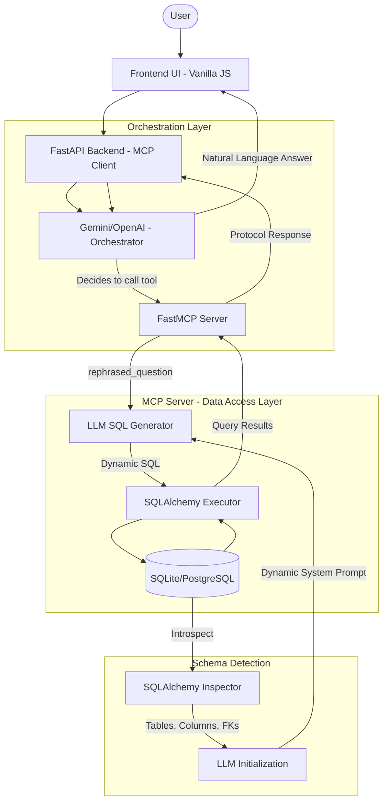
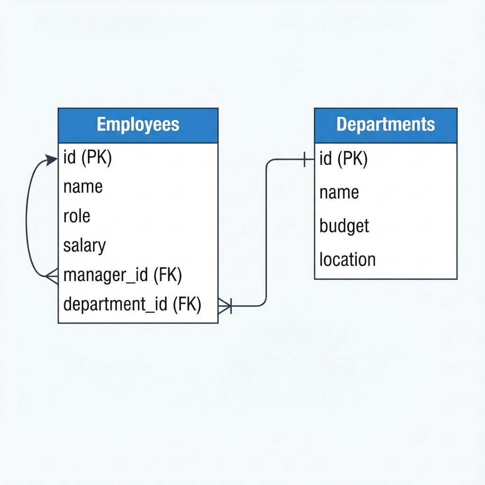
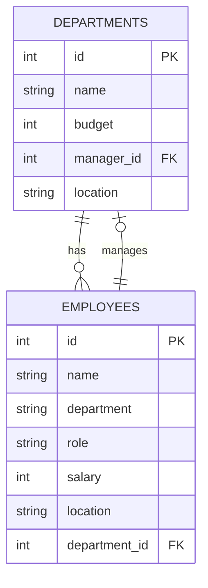
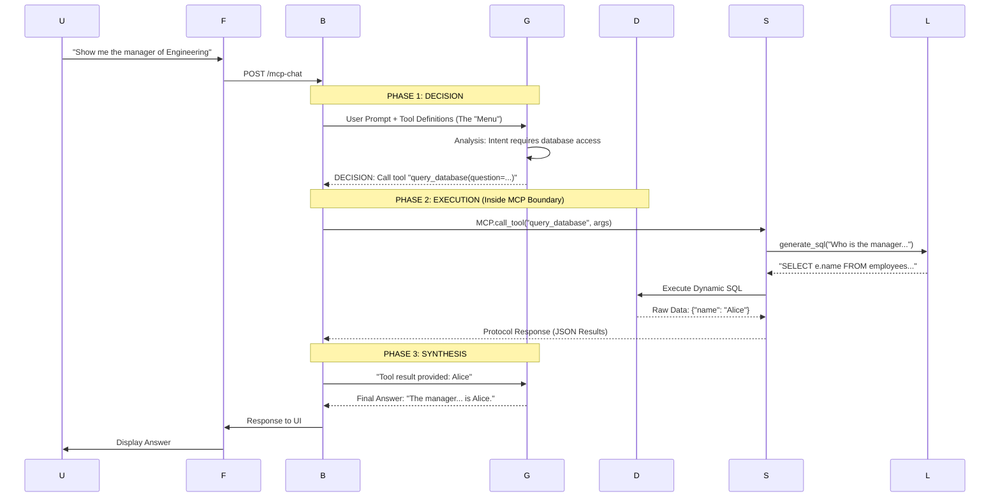

# Chat-to-Data Architecture Document

This document outlines the Proof of Concept (POC) architecture for the Chat-to-Data application, focusing on the integration of the Model Context Protocol (MCP) and **Dynamic SQL Generation**.

---

## 🎯 Core Objective
The primary goal of this POC is to demonstrate that an LLM can interact with **any structured database** through an MCP server using **zero hardcoded SQL queries or schema definitions**. The system automatically detects database structure at startup and dynamically generates SQL based on natural language prompts. Supports both SQLite (with auto-initialized sample data) and PostgreSQL (with runtime schema introspection).

---

## 🌐 System Context
Shows the system's relationship with external users, API providers, and databases.

  

View Mermaid Source

---

## 🏗️ Technical Architecture
Detailed view of the internal components with **dynamic schema detection** and the **MCP boundary**.

  

View Mermaid Source

---

## 📊 Data Model
The system **automatically detects** the database schema at startup using SQLAlchemy introspection. Below is an example schema (SQLite default with employee/department sample data).

**Note:** When using PostgreSQL, the system will detect YOUR actual schema and generate appropriate LLM prompts for whatever tables exist in your database.

  

View Mermaid Source (Example: Default SQLite Schema)

---

### Independent Multi-Server Registry
The system is designed to treat MCP servers as modular, independent units.
- **Registry**: The `MCP_SERVER_REGISTRY` in `main.py` acts as a central list of local or remote MCP URLs.
- **Aggregated Discovery**: On startup, the client polls *every* server in the registry, aggregating their tools into a single logical "toolbox" for Gemini.
- **Dynamic Routing**: The system maintains a `TOOL_TO_SERVER_MAP`. When Gemini requests a tool call, the backend automatically routes the request to the specific server that provides that tool.
- **Horizontal Scaling**: You can add specialized servers (e.g., Google Search, Slack, GitHub) simply by adding their endpoint URL to the registry.

---

## 🔄 Dynamic SQL Flow
The system generates required SQL on-the-fly, mapping natural language to the schema without any pre-defined query strings.

### Execution Sequence

  

View Mermaid Source

---

## 🧩 Key Components

| Component | Responsibility | Technology |
| :--- | :--- | :--- |
| **Frontend** | Interactive UI and result visualization. | HTML, CSS, Vanilla JS |
| **MCP Client** | FastAPI backend orchestrating LLM tool calls. | Python, FastAPI, FastMCP |
| **MCP Server** | Encapsulates database tools and SQL generation (generic). | Python, FastMCP Server |
| **Schema Detector** | Introspects database structure and generates LLM prompts. | SQLAlchemy Inspector |
| **SQL Generator** | Translates text to SQL queries via dynamic schema context. | Gemini 2.0 Flash or GPT-4o-mini |
| **Database** | Stores data (auto-initialized SQLite or existing PostgreSQL). | SQLite or PostgreSQL |
| **ORM Layer** | Database abstraction and query execution. | SQLAlchemy |

---

## 🛡️ Security & Constraints
- **Read-Only**: SQL generation is restricted to `SELECT` operations only.
- **Protocol Isolation**: LLM access is filtered through enforced MCP tool boundaries.
- **Query Sanitization**: Backend validation prevents execution of destructive commands.
